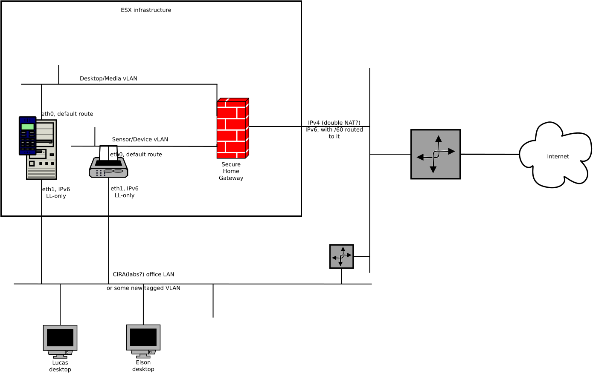

Secure Home Gateway virtual
---------------------------

Goal: permit people to be productive from their desktop
environment and still access the SHG environment.

Challenge: to properly be "in" the SHG environment, one needs to be
"behind" the SHG.  That is, have it as "your" default IPv4 and IPv6 route.

Problem: putting one's desktop behind a gateway disconnects you from all the
tools that you need to actually be productive and actually fix the gateway.

Productive is defined as having all their normal internet access, chat,
github, etc. without having to move any cables or do any special network
configuration.  But, still have convenient access to the testing environment.

Solution: set up a few virtual machines that are behind the gateway, and
access them via a second interface (a backdoor) using SSH (with X-windows
forwarding), and VNC (for Android emulator access).

As the virtual machines have to point their default route to the SHG,
they can not conveniently have any extra routing.  In order to access these
interfaces, use IPv6 Link-Local addresses (fe80::%eth0) which are ALWAYS
configured, and are always without any routing complications.

Workaround: the connection to the eth1 interfaces must be via LAYER TWO tricks
only all the way to the user's desktops.  Thus the need for "CIRALabs office
LAN" connectivity, or some kind of 802.1Q connection.

Virtual Office test environment
===============================

The firewall icon is a Virtual machine running the OpenWRT SHG image.
It has three network interfaces attached:

* WAN link goes up to CIRA Labs infrastructure. WAN link has IPv4 (public,
  ideally), as well as an IPv6 (SLAAC or DHCPv6 or static), as well as an
  IPv6 prefix (/60 at least) delegated/routed to it.

* Desktop vLAN link is a virtual ESX virtual switch attached to the OpenWRT image.

* Sensor vLAN link is a second ESX virtual switch attached to the OpenWRT image.

The tower case icon is an Ubuntu VM (100G disk) that has two interfaces.  eth0
attached to an internal Linux bridge via /etc/network/interfaces.  This
bridge is attached to the Desktop vLAN, and the default route for this
machine is via the OpenWRT.

The eth1 on the tower is attached to the physical LAN on which Lucas and
Elson's desktops are.  If this is impractical or considered too insecure,
then attach it to a physical (802.1q tagged) VLAN which is extended to their
desktops and configure a tagged interface on their desktop.
The eth1 should be configured without DHCPv4 or DHCPv6, and it should have
the accept_ra sysctl turned off (so it does not receive a SLAAC IPv6).

The tower case has an Android Studio installed on it such that it can run
the Android emulator (under VNC), and with some slight patches to the
configuration, the emulator will be attached to the Desktop vLAN, such
it has the OpenWRT as it's uplink.

The printer icon is a second Linux VM, running anything, could even be live
CD image.  It is there to just represent being a sensor device.  It has it's
eth0 and eth1 configured the same as "tower case".

Remote work
===========

The simplest way to let people work remote is to have another machine
on the OFFICE LAN to which telecommuters can SSH into, and then setup a port
forward that goes unto the fe80:...%eth0 connection to the tower case.

